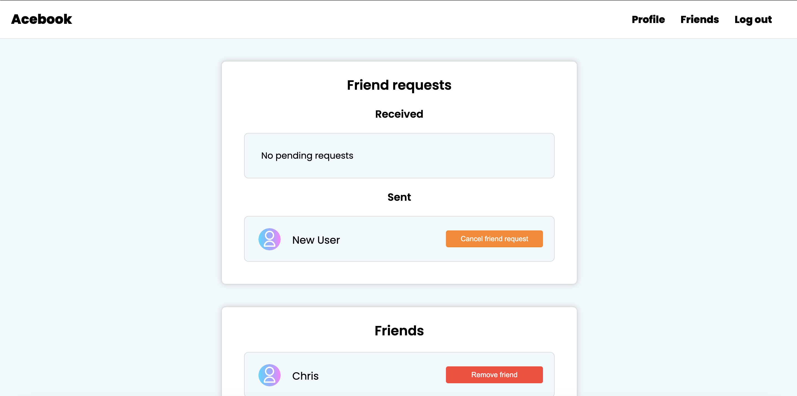
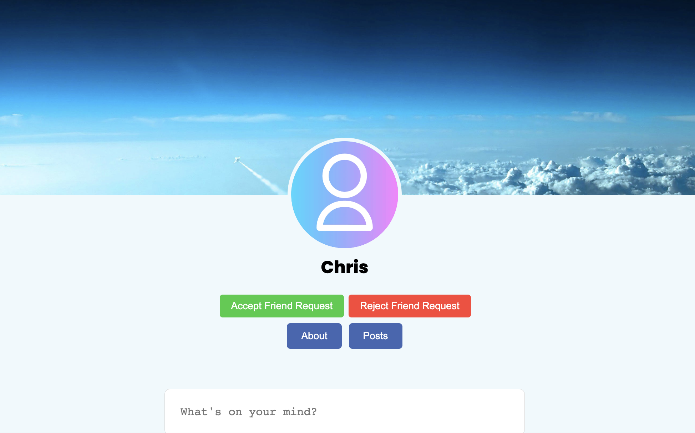
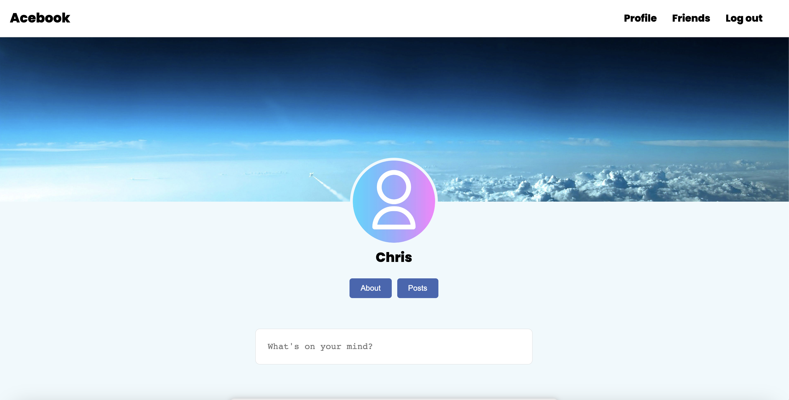
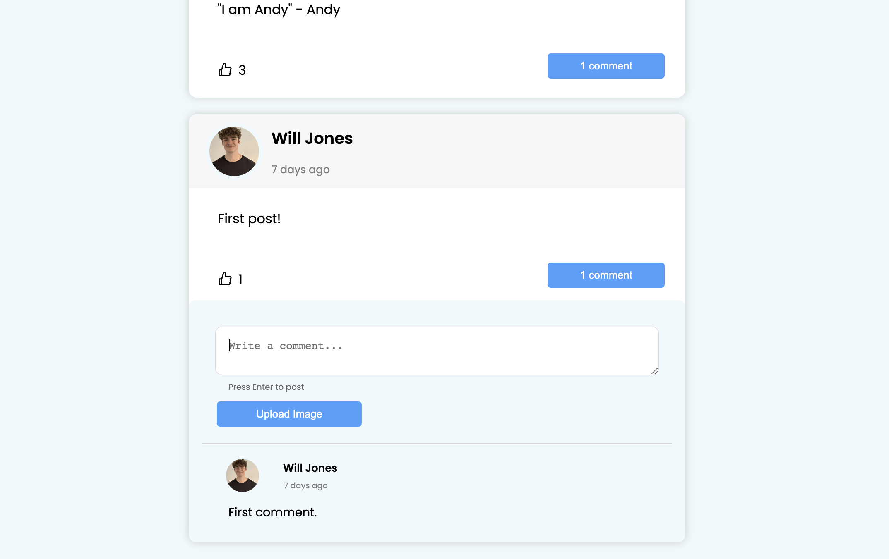
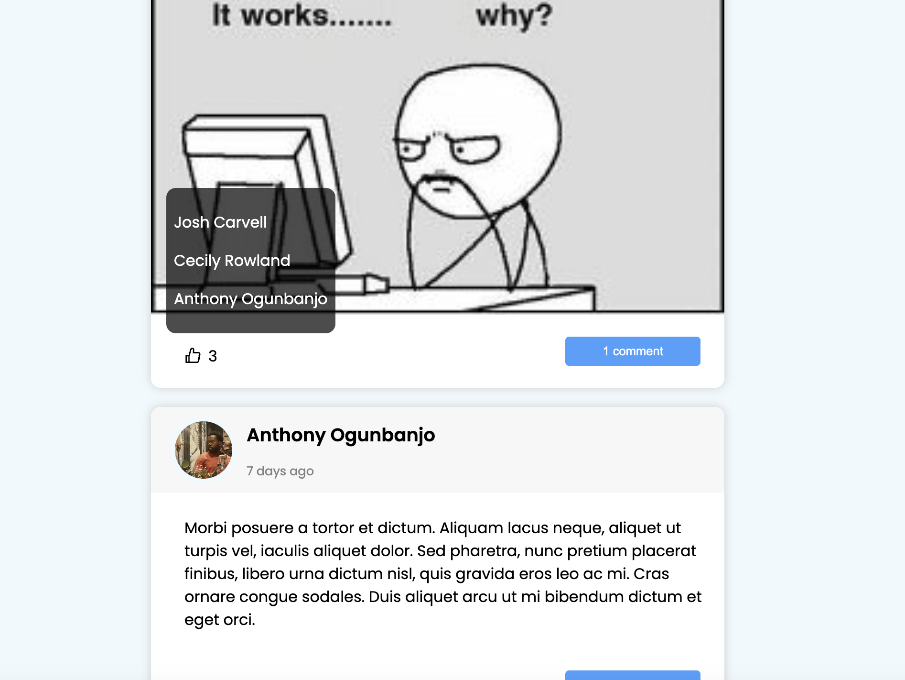

# Acebook

## About this project
Acebook is a social networking site that resembles Facebook, created as part of the curriculum at Makers Academy during weeks 8-9 of the engineering program. The platform was constructed utilizing the MERN (MongoDB, Express, React, and Node.js) technology stack. Jest was used to test the backend and cypress was used to test the frontend.

## Features
* User sign up
* User log in / log out
* Create a new post / view a timeline of posts
* Create comments on posts
* Like / unlike posts & comments
* Post pictures or gifs
* Send a friend request, cancel a friend request, accept/ reject a friend request and delete a friend
* Update profile picture / cover photo

## Learnings from this project
Through creating this app in a group environment, I improved my ability to:
- Work and communicate effectively within a software development team
- Break down projects into tasks and assign them to pairs
- Use agile ceremonies to organise work into sprints and improve processes
- Use a developer workflow to plan, implement and peer-review features
- Build fullstack web applications using the MERN stack
- Create a MongoDB database and implement routes that interact with and manipulate data in these databases

### Quickstart

#### Install Node.js

1. Install Node Version Manager (NVM)
   ```
   brew install nvm
   ```
   Then follow the instructions to update your `~/.bash_profile`.
2. Open a new terminal
3. Install the latest version of [Node.js](https://nodejs.org/en/), currently `18.1.0`.
   ```
   nvm install 18
   ```

#### Project setup

1. Clone this repository to your local machine
2. Install Node.js dependencies for both FE and BE (API)
   ```
   ; cd api
   ; npm install
   ; cd ../frontend
   ; npm install
   ```
3. Install an ESLint plugin for your editor.
4. Install MongoDB
   ```
   brew tap mongodb/brew
   brew install mongodb-community@5.0
   ```
   *Note:* If you see a message that says `If you need to have mongodb-community@5.0 first in your PATH, run:`, follow the instruction. Restart your terminal after this.
5. Start MongoDB
   ```
   brew services start mongodb-community@5.0
   ```

#### Start

1. Start the server

  **Note the use of an environment variable for the JWT secret**

   ```
   ; cd api
   ; JWT_SECRET=SUPER_SECRET npm start
   ```
2. Start the front end

  In a new terminal session...

  ```
  ; cd frontend
  ; npm start
  ```

#### Testing


#### The Backend (API)

**Note the use of an environment variable for the JWT secret**

  Start the server in test mode (so that it connects to the test DB)

  ```
  ; cd api
  ; JWT_SECRET=SUPER_SECRET npm run start:test
  ```

  Then run the tests in a new terminal session

  ```
  ; cd api
  ; JWT_SECRET=SUPER_SECRET npm run test
  ```

#### The frontend (React)

**Note the use of an environment variable for the JWT secret**

  Start the server in test mode (so that it connects to the test DB)

  ```
  ; cd api
  ; JWT_SECRET=SUPER_SECRET npm run start:test
  ```

  Then start the front end in a new terminal session

  ```
  ; cd frontend
  ; JWT_SECRET=SUPER_SECRET npm start
  ```

  Then run the tests in a new terminal session

  ```
  ; cd frontend
  ; JWT_SECRET=SUPER_SECRET npm run test
  ```
## Screenshots
#### Login page

#### Friends Page

#### Friend Profile

#### Friend Request Recieved

#### Friend Request Sent

#### Own profile

#### Post with comment

#### Hover over like button to see post likers


